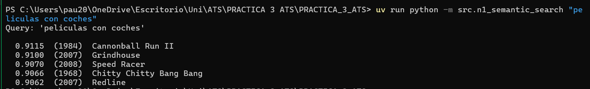
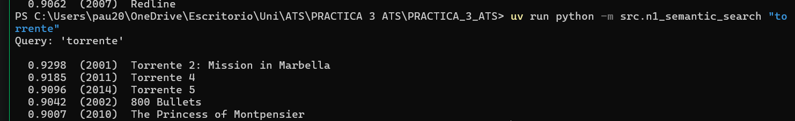
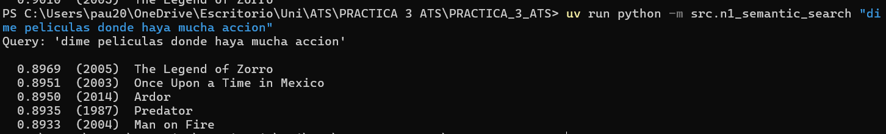
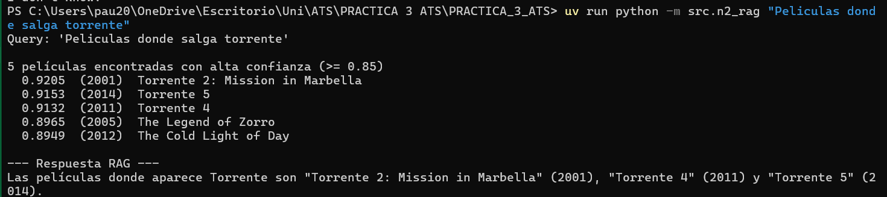
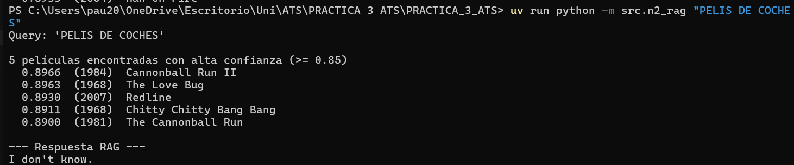
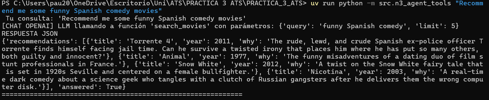
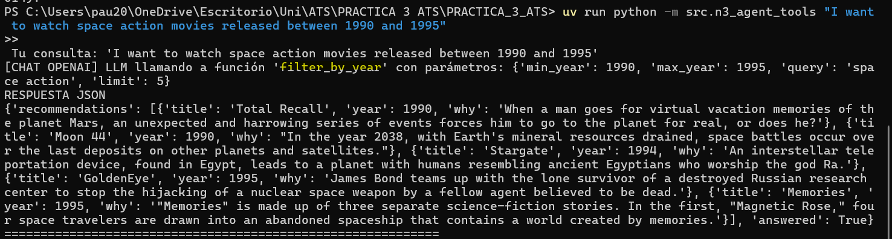
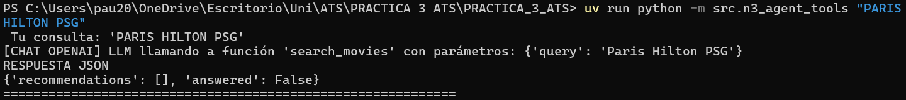

# demo.md — `17`

Aquest fitxer és **obligatori**. Conté dues parts:

1. **Traça d'execució** per cada nivell lliurat (captures, exemples, sortides reals)
2. **Defensa escrita (Q&A)** — 5 preguntes obligatòries (Canal D del rúbric, 15%)

---

## 1. Traça d'execució per nivell

### N1 — Semantic Search

Comanda executada:

```bash
uv run python -m src.n1_semantic_search "peliculas con coches"
```

Sortida real (top-5 pel·lícules amb `vectorSearchScore`):

```
Query: 'peliculas con coches'

  0.9115  (1984)  Cannonball Run II
  0.9100  (2007)  Grindhouse
  0.9070  (2008)  Speed Racer
  0.9066  (1968)  Chitty Chitty Bang Bang
  0.9062  (2007)  Redline
```

Comanda executada:
```bash
uv run python -m src.n1_semantic_search "torrente"
```

Sortida real (top-5 pel·lícules amb `vectorSearchScore`):

```
Query: 'torrente'

  0.9298  (2001)  Torrente 2: Mission in Marbella
  0.9185  (2011)  Torrente 4
  0.9096  (2014)  Torrente 5
  0.9042  (2002)  800 Bullets
  0.9007  (2010)  The Princess of Montpensier
```

Comanda executada:
```bash
uv run python -m src.n1_semantic_search "dime peliculas donde haya mucha accion"
```

Sortida real (top-5 pel·lícules amb `vectorSearchScore`):

```
Query: 'dime peliculas donde haya mucha accion'

  0.8969  (2005)  The Legend of Zorro
  0.8951  (2003)  Once Upon a Time in Mexico
  0.8950  (2014)  Ardor
  0.8935  (1987)  Predator
  0.8933  (2004)  Man on Fire
```

(Repetiu amb 3 queries diferents per demostrar que funciona; almenys una ha de
ser semàntica — sense la paraula clau literal al títol.)

### N2 — RAG (si arribeu)

**Cas positiu** (resposta basada al context):

- Query: `Peliculas donde salga torrente`
- Top-k títols recuperats: `5`
- Resposta de l'LLM (ha de citar títols): `Las películas donde aparece Torrente son "Torrente 2: Mission in Marbella" (2001), "Torrente 4" (2011) y "Torrente 5" (2014).`

**Cas negatiu** (sense context → ha de dir "no ho sé"):

- Query: `PELIS DE COCHES`
- Resposta esperada: `I don't know.`
- Resposta obtinguda: `I don't know.`

### N3 — Tools + Structured Outputs (si arribeu)

3 casos que exerciten **rutes diferents** (cerca / filtre / no trobat):

1. `Recommend me some funny Spanish comedy movies`
2. `I want to watch space action movies released between 1990 and 1995`
3. `PARIS HILTON PSG`

Esquema de sortida (Pydantic o JSON schema):
 
CERCA: 
 
FILTRE ANYS: 
 
BUIT:
 
```python
_____
```

Exemple de sortida estructurada:

```json
_____
```

### N4 — Multi-agent (si arribeu)

Diagrama del flux d'agents (ASCII o referència a `agent_flow_diagram.png`):

```
                    ┌─────────────────────┐
                    │      USER QUERY      │
                    └──────────┬──────────┘
                               │
                               v
                    ┌─────────────────────┐
                    │  RETRIEVER AGENT    │
                    │  (vector search)    │
                    └──────────┬──────────┘
                               │
                               v
                    ┌─────────────────────┐
                    │   RETRIEVED DOCS    │
                    └──────────┬──────────┘
                               │
                               v
                    ┌─────────────────────┐
                    │   CRITIC AGENT      │
                    │  (evaluate context) │
                    └──────────┬──────────┘
                               │
               ┌───────────────┴───────────────┐
               │                               │
               │ sufficient = False            │ sufficient = True
               v                               v
   ┌─────────────────────┐        ┌─────────────────────┐
   │   RETRY NODE        │        │ SYNTHESIZER AGENT   │
   │ (query expansion)   │        │ (final generation)  │
   └──────────┬──────────┘        └──────────┬──────────┘
              │                               │
              │                               v
              │                    ┌─────────────────────┐
              │                    │   FINAL ANSWER      │
              │                    │ (structured JSON)   │
              │                    └─────────────────────┘
              │
              └─────────────── back to RETRIEVER
```

Traça d'una execució amb **reintent** (cas evaluator-optimizer):

```
_____
```

---

## 2. Defensa escrita (Q&A) — **OBLIGATÒRIA**

Responeu OBLIGATÒRIAMENT aquestes **5 preguntes**. Cadascuna avaluada de
0 / 1,5 / 3 punts segons completitud de la resposta (veure rúbrica). Sigueu
breus i precisos.

### Q1 · Què passa si embeus la query amb `text-embedding-3-small` en lloc d'`ada-002`?
Si utilitzem el model text-embedding-3-small enlloc de l'ada-002 per la query, segurament el sistema retornarà resultats aleatoris i per tant, incorrectes. Cada model entén el llenguatge i distribueix els conceptes en un espai matemàtic diferent. Com que la col·lecció sample_mflix.embedded_movies ja ve precalculada per ada-002, si utilitzem el text-embedding-3-small el $vectorSearch de MongoDB calcularà erròniament les distàncies.
_____

### Q2 · Per què `numCandidates` ha de ser > `limit`? Què passa si poses `numCandidates == limit`?
El paràmetre numCandidates indica quants candidats explorarà l'algorisme abans de seleccionar els resultats finals. En MongoDB Atlas Vector Search s'utilitza un índex basat en HNSW, que realitza una cerca aproximada (Approximate Nearest Neighbors, ANN) navegant per un graf de veïns. Per aquest motiu, numCandidates ha de ser superior a limit: primer s'explora un conjunt ampli de candidats i després es seleccionen els limit millors resultats.

Si numCandidates == limit, l'espai d'exploració és molt reduït i HNSW podria no visitar alguns veïns rellevants del graf. Això disminueix el recall i pot provocar que es retornin documents menys similars que els realment més propers al vector de consulta.

### Q3 · Si el `$vectorSearch` NO troba res rellevant, què retorna el teu RAG? Per què?
Quan $vectorSearch no retorna documents amb una similitud suficient, la funció retorna una llista buida. El prompt del sistema indica explícitament que, en aquest cas, el model ha de respondre "I don't know" (o answered=false en la versió amb sortida estructurada) i no inventar informació, tal i com podem veure a continuació:
   
   You are a retrieval-augmented assistant. 

    RULES:
    1. Use ONLY the provided context.
    2. The context is the ONLY source of truth.
    3. NEVER use external knowledge.
    4. Never infer or assume facts that are not explicitly stated.
    5. If the answer is not fully supported by the context, respond exactly:
    "I don't know."
    6. DO NOT partially answer.
    7. Always cite the movie titles used in your answer.
    8. If the movie of the context IS NOT relacionated with the question DO NOT take it into account.`

On, al punt 2 es posa que l'única font de coneixement és el context, per tant no ha d'anar a buscar coses de fora. També, que si no pots arribar a la resposta a través del context, que posi el "I don't know". Entre d'altres per evitar al·lucionacions.
_____

### Q4 · Per què trieu `cosine` i NO `euclidean` / `dotProduct`?
Triem cosine similarity perquè els embeddings de text codifiquen principalment informació semàntica en la direcció del vector. Cosine compara l'angle entre vectors i és relativament independent de la seva magnitud, fet que la fa especialment adequada per a cerca semàntica.

En canvi, euclidean distance depèn de la longitud dels vectors i dues representacions semànticament similars podrien aparèixer llunyanes si tenen magnituds diferents. Dot product també és sensible a la magnitud, de manera que vectors més llargs poden obtenir puntuacions elevades encara que no siguin els més similars semànticament.

Per aquest motiu, cosine és la mètrica habitual en sistemes RAG basats en embeddings textuals.

### Q5 (trieu UNA segons el vostre nivell màxim)

**Si heu fet N4:** Quina condició fa que l'orquestrador reintenti? Com evites el bucle infinit?
L'orquestrador decideix reintentar basant-se en la funció encaminadora (should_retry), la qual llegeix l'estat generat pel node crític (critic_node). Si aquest estat state["evaluation"]["sufficient"] és False, es tornarà a reintentar. I això ocurreix si la llista de docs és buida (no té documents), si és menor a dos documents i si avg_score < 0.75.
S'evita el bucle infinit quan arriba al node synthesize i, a partir d'aquí, finalitzarà (com veiem a la gràfica de N4 — Multi-agent (si arribeu))


_____
